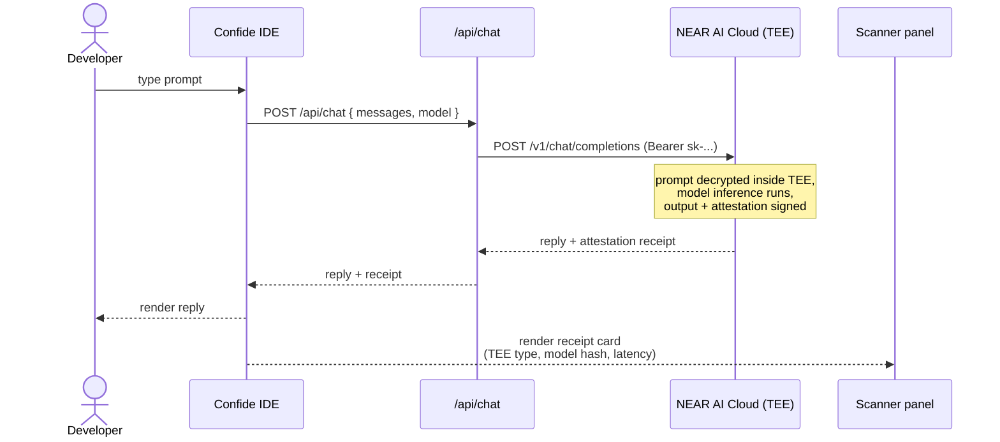

# Confide — The Confidential AI IDE

> Code with AI. Prove nothing leaked.

Confide is an IDE that routes every AI completion through a hardware-isolated
Trusted Execution Environment (TEE) on **NEAR AI Cloud**. Your code, prompts,
and context never leave your boundary — and every reply ships with a
cryptographic attestation receipt you can verify in under 30 seconds.

Inspired by [Orgn](https://www.orgn.com/), built on the open NEAR AI stack.

---

## What we're building

| Surface | Status | Description |
|---|---|---|
| **Landing page** | ✅ shipped | Dark-themed marketing site — hero, how-it-works, features, metrics, pricing, CTA, footer |
| **`/chat` workspace** | ⏳ next | Two-pane IDE preview: chat on the left, live Scanner (attestation receipts) on the right |
| **`/api/chat`** | ⏳ next | Server-side proxy that holds the NEAR API key and forwards prompts to `/v1/chat/completions` |
| **Audit log** | ⏳ next | Per-message receipt history (browser-local for v0) |
| **Pricing / Stripe** | later | Marketing copy only for MVP |
| **VS Code extension** | later | Real CDE clone after the web IDE is solid |

---

## Architecture

### Side-by-side: today vs Confide

```
  YOUR LAPTOP                           CONFIDE (this repo)                    NEAR AI CLOUD
  ┌─────────────────┐                   ┌───────────────────┐                  ┌──────────────────────┐
  │                 │                   │                   │                  │ ┌──────────────────┐ │
  │  Code editor    │ ── prompt ──▶     │  Next.js IDE      │ ── HTTPS ──▶    │ │  Intel TDX TEE   │ │
  │  + AI plugin    │                   │  /api/chat        │  (sk-... key)    │ │  + H100 CC GPU   │ │
  │                 │ ◀── reply ──      │                   │ ◀── receipt ──   │ │  + GLM-4.6 / …   │ │
  └─────────────────┘                   └───────────────────┘                  │ └──────────────────┘ │
         │                                       │                              │         │            │
         ▼                                       ▼                              │         ▼            │
   ┌──────────┐                          ┌──────────────┐                       │  Attestation        │
   │ Provider │                          │  Scanner UI  │                       │  (signed by TEE)    │
   │ sees     │                          │  shows the   │                       └──────────────────────┘
   │ your raw │                          │  receipt     │
   │ code 😱  │                          │  per message │
   └──────────┘                          └──────────────┘
```

### Component diagram

```mermaid
flowchart LR
    subgraph User[User device]
        U[Confide IDE\nNext.js + React 19]
    end

    subgraph Server[Confide server]
        API[/api/chat\nNext.js route]
        SC[Scanner UI\nattestation panel]
    end

    subgraph NEAR[NEAR AI Cloud]
        GW[Gateway\nOpenAI-compatible]
        TEE[Intel TDX TEE\n+ H100 CC GPU]
        M1[GLM-4.6 FP8]
        M2[DeepSeek V3.1]
        M3[GPT-OSS 120B]
        M4[Qwen3 30B]
        ATT[Attestation\nservice]
    end

    U -->|prompt| API
    API -->|sk-... bearer| GW
    GW --> TEE
    TEE --> M1 & M2 & M3 & M4
    TEE --> ATT
    ATT -->|signed receipt| API
    API -->|reply + receipt| U
    U --> SC
```

### Sequence — a single prompt's lifecycle



---

## Tech stack

| Layer | Tool |
|---|---|
| Framework | Next.js 16 (App Router) |
| UI | React 19, Tailwind v4, framer-motion |
| Inference | NEAR AI Cloud — `cloud-api.near.ai` |
| Models | GLM-4.6 FP8, DeepSeek V3.1, GPT-OSS 120B, Qwen3 30B A3B |
| Enclave | Intel TDX + Nvidia H100 Confidential Compute |
| Hosting | Vercel (planned) |

---

## Quick start

```bash
cd frontend
cp .env.example .env.local        # paste your NEAR_API_KEY
npm install
npm run dev                       # http://localhost:3000
```

The landing page renders without a key. The `/chat` workspace will require
`NEAR_API_KEY` once it's built.

---

## Project layout

```
near boom/
├── README.md                     ← this file
├── plan.md                       ← full MVP plan
├── near-ai-cloud-api.md          ← NEAR API reference
└── frontend/
    ├── package.json
    ├── .env.example
    └── app/
        ├── layout.tsx
        ├── page.tsx              ← landing
        ├── globals.css
        └── components/
            ├── Navbar.tsx
            └── ui/
                ├── reveal.tsx
                ├── animated-wave.tsx
                ├── metrics-section.tsx
                └── powered-by.tsx
```

---

## Why this matters

| Without TEE | With Confide on NEAR |
|---|---|
| Provider sees your raw code | Provider sees only ciphertext |
| You trust the SaaS log policy | You hold a signed receipt |
| Defense, finance, healthcare can't use AI coding tools | They can — verifiably |
| One vendor lock-in per model | One API, four frontier models |
| "Trust us" | "Verify us" |

---

## Status

- ✅ Landing page (dark theme, animated, full sections)
- ⏳ `/chat` workspace + `/api/chat` route
- ⏳ Live attestation receipts in the Scanner panel
- ⏳ Model picker (calls `GET /v1/model/list`)
- ⏳ Local audit log

See [plan.md](./plan.md) for the full roadmap.

---

## License

Private — © 2026 Ayush Singh. All rights reserved.
